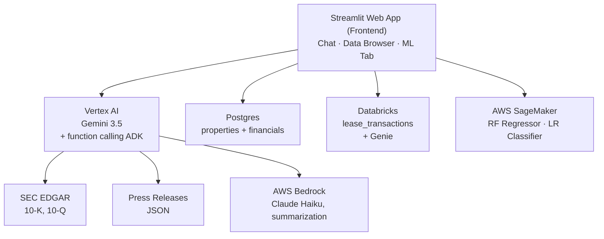

# Prologis Financial Assistant — Databricks Edition

[](https://prologis-databricks-ai.streamlit.app/)
[](#setup)
[](#databricks)
[](#vertex-ai)
[](#machine-learning-models)

End-to-end AI-powered Financial Assistant Web Application for **Prologis (NYSE: PLD)**, a global industrial real estate investment trust. The platform combines structured data querying, classic machine learning (regression and classification), and generative AI to retrieve financial and property insights, perform predictive analytics, and provide natural-language summaries.

Built as a multi-cloud system:

- **Postgres on Supabase** — property / financial data
- **Databricks** — lease transaction data, plus a Genie space for natural-language SQL
- **AWS SageMaker** — hosted regression and classification models
- **Google Cloud Vertex AI** — conversational agent with function calling (the primitive that underpins the Vertex AI Agent Development Kit)
- **AWS Bedrock (Claude Haiku)** — press-release summarization

> **Try it live:** [https://prologis-databricks-ai.streamlit.app/](https://prologis-databricks-ai.streamlit.app/)
>
> **Repository:** [github.com/bmabhishek/Prologis_Databricks_AI_Assistant](https://github.com/bmabhishek/Prologis_Databricks_AI_Assistant)

---

## Contents

- [Architecture](#architecture)
- [Data sources](#data-sources)
- [Repository layout](#repository-layout)
- [Setup](#setup)
- [Machine learning models](#machine-learning-models)
- [Conversational agent](#conversational-agent)
- [Genie: natural-language analytics on Databricks](#genie-natural-language-analytics-on-databricks)
- [Running the app](#running-the-app)
- [Multi-cloud summary](#multi-cloud-summary)
- [Known limitations](#known-limitations)

---

## Architecture

```text
┌────────────────────────────────────────────────────────────────────────────────────────┐
│                              Streamlit Web App (Frontend)                              │
│                            Chat  |  Data Browser  |  ML Tab                            │
└───────────┬──────────────────────┬──────────────────────┬──────────────────────┬───────┘
            │                      │                      │                      │
┌───────────┴──────────┐  ┌────────┴───────┐  ┌───────────┴──────────┐  ┌────────┴───────┐
│      Vertex AI       │  │    Postgres    │  │      Databricks      │  │ AWS SageMaker  │
│      Gemini 3.5      │  │ (properties +  │  │ (lease_transactions) │  │  RF Regressor  │
│  + function calling  │  │  financials)   │  │       + Genie        │  │ LR Classifier  │
│        (ADK)         │  │                │  │                      │  │                │
└─────┬───────────┬────┘  └────────────────┘  └──────────────────────┘  └────────────────┘
      │           │
      │           ├───────────────────┐
      │           │                   │
┌─────┴─────┐  ┌──┴───────┐  ┌────────┴─────────┐
│ SEC EDGAR │  │  Press   │  │   AWS Bedrock    │
│  (10-K,   │  │ Releases │  │  (Claude Haiku,  │
│   10-Q)   │  │  (JSON)  │  │  summarization)  │
└───────────┘  └──────────┘  └──────────────────┘
```



### Cloud services used

- **Google Cloud Vertex AI** — Gemini 3.5 Flash agent using function calling (the underlying primitive of the Vertex AI Agent Development Kit). The model name is read from the `GEMINI_MODEL_NAME` environment variable (default `gemini-3.5-flash`), so it can be swapped without a code change as Google's model lineup evolves.
- **Databricks** — a `lease_transactions` table hosted on a Serverless SQL Warehouse, queried both by the agent's `query_databricks` tool and interactively through a Genie space ("Commercial Lease Analytics") for natural-language text-to-SQL analysis
- **AWS SageMaker** — hosted endpoints for the regression and classification models
- **AWS Bedrock** — Claude Haiku 4.5 for press-release summarization (multi-cloud integration)
- **Supabase Postgres** — `properties` + `financials` database, connected via Supabase's Session pooler (IPv4-compatible on the free tier; see [Postgres setup](#postgres) below)
- **Streamlit Community Cloud** — public web app hosting

---

## Data sources

| Source | Format | Records | Purpose |
| --- | --- | --- | --- |
| **SEC EDGAR** | JSON (XBRL Company Facts API) | Latest 10-K / 10-Q metrics | Authoritative financial data: revenue, net income, operating expenses, total assets / liabilities |
| **Postgres** | `properties` + `financials` tables | 20 properties across 11 US metros | Property-level revenue / expense queries |
| **Databricks** | `lease_transactions` table (Delta) | 25 lease records across 11 US metros | Tenant, rent, and lease-term data for industrial / logistics leases |
| **Press releases** | JSON | 10 mocked Prologis releases | Acquisitions, expansions, earnings, sustainability announcements |

The 20 sample properties span Los Angeles, Chicago, New York, Kansas City, Dallas, Miami, Seattle, Phoenix, Portland, Philadelphia, and Atlanta with mixed Industrial / Logistics / Warehouse types. The 25 lease transactions span the same 11 metros across six tenant industries (E-commerce, Cold Storage, Automotive, 3PL, Retail Distribution, Manufacturing), with lease start dates from March 2023 through January 2026.

---

## Repository layout

```text
Prologis_Databricks_AI_Assistant/
├── agent/
│   ├── tools.py            # 4 data-source tools exposed to the agent
│   ├── bedrock.py          # AWS Bedrock summarization helper
│   ├── warehouse.py        # Databricks SQL Warehouse status / wake-up (REST API)
│   └── agent.py            # Vertex AI agent with function calling
├── app/
│   └── streamlit_app.py    # 3-tab Streamlit frontend
├── data/
│   ├── press_releases.json # 10 mocked press releases
│   └── sec/                # cached SEC EDGAR responses
├── db/
│   ├── schema.sql          # properties + financials tables (Postgres)
│   └── seed.sql            # 20 sample properties + financials (Postgres)
├── ml/
│   ├── regression/         # California Housing -> Random Forest
│   │   ├── train.py
│   │   ├── inference.py    # SageMaker inference handler
│   │   └── metrics.json
│   ├── classification/     # UCI Bank Marketing -> Logistic Regression
│   │   ├── train.py
│   │   ├── inference.py
│   │   └── metrics.json
│   └── plots/              # rendered metric/feature plots
├── notebooks/
│   ├── regression_training.ipynb
│   └── classification_training.ipynb
├── scripts/
│   ├── fetch_sec.py        # pull SEC EDGAR data
│   ├── deploy_sagemaker.py # deploy both endpoints
│   ├── delete_endpoints.py # cleanup
│   └── generate_plots.py   # render evaluation plots
├── requirements.txt
└── .env.example
```

---

## Setup

### Prerequisites

- macOS / Linux with **Python 3.9** (the SageMaker sklearn `1.2-1` container expects 3.9 — using a matching local env avoids pickle compatibility issues)
- Postgres 15+ (or a Supabase Postgres project)
- A Databricks workspace (Free Edition is sufficient) with a running SQL Warehouse
- AWS account with Bedrock and SageMaker access
- Google Cloud project with Vertex AI enabled (Express Mode works without billing for 90 days)

### Local environment

```bash
# Clone and enter the project
git clone https://github.com/bmabhishek/Prologis_Databricks_AI_Assistant.git
cd Prologis_Databricks_AI_Assistant

# Conda env with Python 3.9 to match SageMaker container
conda create -n smpy39 python=3.9 -y
conda activate smpy39

pip install -r requirements.txt
```

### Postgres

Two paths — local for development, Supabase for the deployed app.

**Local (development):**

```bash
brew install postgresql@15
brew services start postgresql@15
createdb financial_assistant
psql -d financial_assistant -c "CREATE USER postgres WITH SUPERUSER PASSWORD 'postgres';"
psql -h localhost -U postgres -d financial_assistant -f db/schema.sql
psql -h localhost -U postgres -d financial_assistant -f db/seed.sql
```

**Supabase (deployed app):**

1. Create a free Supabase project at [https://supabase.com](https://supabase.com)
2. Open the SQL editor and run `db/schema.sql` then `db/seed.sql`
3. Grab the connection string under **Project Settings → Database → Connect → Direct** (or the **Connect** button on the project dashboard)
4. Under Connection Method, use **Session pooler**, not Direct connection — Supabase's direct connection endpoint is IPv6-only by default, and a dedicated IPv4 address is a paid Pro Plan add-on. The Session pooler is IPv4-proxied for free and works from any hosting platform without extra configuration.
5. Use the pooler's host, port, db, user, and password values in `.env` (the pooler username is formatted as `postgres.<project-ref>`, not plain `postgres`)

Verify with `psql ... -c "SELECT COUNT(*) FROM properties;"` — should return **20**.

### Databricks

1. Create a Databricks workspace (Free Edition works) and confirm a SQL Warehouse is running (Serverless is fine for this dataset's scale)
2. In the SQL Editor, run:

```sql
CREATE TABLE workspace.default.lease_transactions (
    lease_id            BIGINT GENERATED ALWAYS AS IDENTITY,
    tenant_name         STRING NOT NULL,
    tenant_industry     STRING NOT NULL,
    metro_area          STRING NOT NULL,
    sq_footage          INT NOT NULL,
    lease_start         DATE NOT NULL,
    lease_term_months   INT NOT NULL,
    rent_per_sqft       DECIMAL(6,2) NOT NULL,
    annual_rent         DECIMAL(14,2) NOT NULL,
    lease_type          STRING NOT NULL
);
```

3. Insert the 25 seed lease records (see the project's Databricks setup notes for the full `INSERT` statement)
4. Open **SQL Warehouses → your warehouse → Connection details** and note the Server hostname and HTTP path
5. Generate a personal access token under **Settings → Developer → Access tokens**, scoped narrowly to `sql` (not "all APIs")
6. Add to `.env`:

```bash
DATABRICKS_SERVER_HOSTNAME=your-workspace.cloud.databricks.com
DATABRICKS_HTTP_PATH=/sql/1.0/warehouses/your-warehouse-id
DATABRICKS_ACCESS_TOKEN=dapi...
```

7. *(Optional but recommended)* Create a Genie space in the Databricks sidebar, scoped to `workspace.default.lease_transactions`, for interactive natural-language querying of the same data outside the chat agent. Adding a short description of the table's columns and business context (e.g. what `annual_rent` already represents, what `lease_type` values mean) noticeably improves Genie's answer accuracy.

Verify with `SELECT COUNT(*) FROM workspace.default.lease_transactions;` in the SQL Editor — should return **25**.

### Vertex AI

The chatbot routes through **Google Cloud Vertex AI** using the unified `google-genai` SDK. The agent declares tool schemas and Gemini decides which tools to call — this is the same function-calling primitive the **Vertex AI Agent Development Kit (ADK)** is built on.

1. Open [https://console.cloud.google.com/vertex-ai](https://console.cloud.google.com/vertex-ai) (now branded as "Agent Platform")
2. Click **Enable APIs** — Express Mode allows 90 days of free Vertex AI access without billing
3. Click **Get API key** in the left sidebar and copy the key
4. Add to `.env`:

```bash
GOOGLE_API_KEY=AIza...
GOOGLE_GENAI_USE_VERTEXAI=False
GEMINI_MODEL_NAME=gemini-3.5-flash
```

> **Note:** `GOOGLE_GENAI_USE_VERTEXAI` is set to `False` here because this project authenticates with a plain Gemini API key rather than a Vertex AI-scoped service account key. If your API key is specifically scoped to the Vertex AI / Agent Platform API, set this to `True` instead.

### Environment variables

```bash
cp .env.example .env
# Then edit .env to fill in your real values:
#   GOOGLE_API_KEY            -- Gemini API key (Express Mode)
#   GOOGLE_GENAI_USE_VERTEXAI -- True or False, see note above
#   GEMINI_MODEL_NAME         -- e.g. gemini-3.5-flash; keep in sync with Google's current model lineup
#   POSTGRES_*                -- Supabase (Session pooler) or local Postgres credentials
#   DATABRICKS_SERVER_HOSTNAME, DATABRICKS_HTTP_PATH, DATABRICKS_ACCESS_TOKEN
#   AWS_ACCESS_KEY_ID, AWS_SECRET_ACCESS_KEY, AWS_REGION
#   SAGEMAKER_BUCKET, SAGEMAKER_ROLE_ARN
```

If deploying to Streamlit Community Cloud, add the same variables under **Manage app → Settings → Secrets** in TOML format. Streamlit's `st.secrets` does not automatically populate `os.environ`, so `app/streamlit_app.py` bridges them explicitly on startup. After changing Secrets, use **Reboot app** rather than relying on the automatic redeploy, since a plain redeploy does not always pick up newly saved Secrets in the running process.

### SEC data

```bash
# First edit scripts/fetch_sec.py to put your real email in the User-Agent
python scripts/fetch_sec.py
```

This populates `data/sec/prologis_financials.json` with the latest annual + quarterly metrics from the SEC company facts API.

---

## Machine learning models

Full notebooks with EDA, training, and evaluation are in `notebooks/`.

### Regression — Random Forest on California Housing

**Dataset:** California Housing (`sklearn.datasets.fetch_california_housing`) — 20,640 samples, 8 numeric features. Target: median house value (in 100k USD).

**Pipeline:** `StandardScaler` → `RandomForestRegressor(n_estimators=100, max_depth=15, min_samples_split=5)`.

**Train + evaluate locally:**

```bash
python ml/regression/train.py
```

**Test set metrics:**

| Metric | Value |
| --- | --- |
| RMSE | $51,024 |
| MAE | $33,270 |
| R² | 0.8014 |

The most important features are **median income (54.2%)**, average occupancy (13.9%), and latitude / longitude (~17% combined) — geographically and economically intuitive.

### Classification — Logistic Regression on UCI Bank Marketing

**Dataset:** UCI Bank Marketing (45,211 records, 16 features). Binary target: did the customer subscribe to a term deposit (yes/no). The dataset is highly imbalanced (~88% no, 12% yes) so the model is trained with `class_weight="balanced"` to prioritize recall.

**Pipeline:** `ColumnTransformer(StandardScaler on numerics, OneHotEncoder on categoricals)` → `LogisticRegression(class_weight="balanced", max_iter=1000)`.

**Train + evaluate locally:**

```bash
python ml/classification/train.py
```

**Test set metrics:**

| Metric | Value |
| --- | --- |
| Accuracy | 0.846 |
| Precision | 0.419 |
| Recall | 0.819 |
| F1 | 0.555 |

The confusion matrix shows the recall–precision trade-off: the model captures **819 of 1,058 actual subscribers** (high recall) at the cost of more false positives. For a bank marketing context — where calling extra prospects is cheap but missing a real subscriber is costly — this is the right trade-off.

### Deployment to SageMaker

```bash
python scripts/deploy_sagemaker.py
```

This script:

1. Tarballs each `model.joblib` to S3
2. Creates a SageMaker `SKLearnModel` for each, pointing to the local `inference.py` as `source_dir`
3. Deploys to `ml.m5.large` instances using the `1.2-1` sklearn framework container (Python 3.9, sklearn 1.2.x) — note this replaces the older `ml.t2.medium` instance type, which AWS has since deprecated
4. Auto-populates `SAGEMAKER_REGRESSION_ENDPOINT` and `SAGEMAKER_CLASSIFICATION_ENDPOINT` in `.env`

Total deploy time: **~12 minutes** for both endpoints.

Both inference scripts (`ml/*/inference.py`) implement the standard SageMaker contract: `model_fn`, `input_fn`, `predict_fn`, `output_fn`.

To clean up after the demo:

```bash
python scripts/delete_endpoints.py
```

---

## Conversational agent

The agent uses the unified `google-genai` SDK routed through **Google Cloud Vertex AI Express Mode**. The agent declares five tool schemas; Gemini decides which tools to call and in what order. This is the same function-calling primitive that powers the Vertex AI Agent Development Kit. The active model is controlled by the `GEMINI_MODEL_NAME` environment variable (currently `gemini-3.5-flash`) rather than hardcoded, so it can be updated in one place — including the Streamlit sidebar display — as Google's model lineup changes.

### Tools available to the agent

| Tool | Purpose | Backed by |
| --- | --- | --- |
| `query_postgres(metro_area, property_type, min_revenue)` | Filter properties + financials | Postgres (Supabase) |
| `query_databricks(metro_area, tenant_industry, min_annual_rent)` | Filter lease transactions | Databricks SQL Warehouse |
| `query_sec_edgar(metric, period)` | Look up Prologis revenue, net income, etc. | SEC EDGAR JSON cache |
| `query_press_releases(keywords, category)` | Search press releases by topic | JSON store |
| `summarize_with_bedrock(text, max_words)` | Condense long text to N words | AWS Bedrock (Claude Haiku 4.5) |

`query_databricks` mirrors `query_postgres`'s design intentionally: same case-insensitive filtering convention, same `{count, records, summary}` return shape, same numeric-casting pattern for JSON serialization — so the agent (and Gemini's downstream answer synthesis) treats both tools consistently despite querying two entirely different cloud data platforms.

### How the agent routes a query

1. User asks a natural-language question in the Chat tab
2. Vertex AI Gemini reads the question and the registered tool schemas
3. The model emits one or more `function_call` blocks naming the tool and arguments
4. The orchestrator (`agent/agent.py`) executes each tool locally and feeds results back
5. Gemini composes a final natural-language answer grounded in the returned data
6. Up to 6 turns of tool-calling are supported (handles multi-source questions)

### Example traces

| Query | Tools called |
| --- | --- |
| *"What was Prologis' net income last year?"* | `query_sec_edgar(metric="net_income", period="annual")` |
| *"Show industrial properties in Chicago with revenue."* | `query_postgres(metro_area="Chicago", property_type="Industrial")` |
| *"Show me lease transactions in Chicago."* | `query_databricks(metro_area="Chicago")` |
| *"What's the average rent for cold storage tenants?"* | `query_databricks(tenant_industry="Cold Storage")` |
| *"Did Prologis announce any acquisitions recently?"* | `query_press_releases(category="acquisition")` |
| *"Summarize the most recent earnings press release."* | `query_press_releases(category="earnings")` → `summarize_with_bedrock(...)` |
| *"Compare property revenues between Dallas and Phoenix."* | `query_postgres(metro_area="Dallas")` → `query_postgres(metro_area="Phoenix")` |

The Streamlit Chat tab shows a **Tools used** expander under each response, displaying which tools fired and what they returned — useful for transparency and debugging.

The multi-source examples demonstrate the multi-cloud agentic chain: a single Vertex AI–orchestrated conversation can route to Postgres, Databricks, SEC EDGAR, press releases, or Bedrock depending on what the question actually needs.

---

## Genie: natural-language analytics on Databricks

Independent of the chat agent, the `lease_transactions` table has a dedicated Genie space (**Commercial Lease Analytics**) configured directly in Databricks, letting anyone with workspace access ask plain-English questions and get back generated SQL, a chart, and a written summary — without going through the Streamlit app at all. This demonstrates Databricks' own native text-to-SQL capability as a complement to the custom `query_databricks` tool integration.

Example verified questions:

- *"What are the counts of leases by lease type?"*
- *"What is the distribution of lease terms in months including min, max, average, and median?"*
- *"What is the monthly count of lease starts?"*

All three produce statistically correct, chart-backed answers directly from the seed data.

---

## Running the app

```bash
streamlit run app/streamlit_app.py
```

The app has three tabs:

| Tab | What it does |
| --- | --- |
| **Chat** | Natural-language Q&A backed by the Vertex AI agent — with an architecture / data-source overview, clickable suggested queries in tabs per source (Databricks, Postgres, SEC EDGAR, press releases + Bedrock, multi-source), a Databricks warehouse status / wake-up control, and per-answer source chips + tool-call inspector |
| **Data** | Properties (Postgres dataframe with metro / type filters), Lease Transactions (Databricks dataframe with metro / industry / lease-type filters and rent KPIs), SEC Filings (latest annual + quarterly values), Press Releases (expandable list with category filter) |
| **ML Predictions** | Sliders / dropdowns that POST to the live SageMaker endpoints and display predictions in real time |


---

## Multi-cloud summary

| Cloud | Service | Component |
| --- | --- | --- |
| **GCP** | Vertex AI (Gemini 3.5 Flash) | Conversational agent / function-calling orchestrator |
| **Databricks** | SQL Warehouse + Genie | Lease transaction queries + natural-language analytics |
| **AWS** | SageMaker | Two hosted ML endpoints (regression + classification) |
| **AWS** | Bedrock (Claude Haiku 4.5) | Press-release summarization |
| **AWS** | S3 | Model artifact storage |
| **AWS** | IAM | SageMaker execution role + CLI user |
| — | Supabase (managed Postgres) | Properties + financials |

The cross-cloud design is functional, not just decorative: queries that need a press release summary call **Bedrock** (AWS), predictions go to **SageMaker** (AWS), lease data comes from **Databricks**, and agent reasoning happens in **Vertex AI** (GCP).

---

## Known limitations

- The Postgres seed and the Databricks lease transactions are both synthetic (revenue / rent figures constructed for demonstration) — the **SEC EDGAR data is real**
- Press releases are mocked (the assignment explicitly allows this); a production version would use Prologis Investor Relations RSS or scraping
- The SageMaker container is constrained to sklearn 1.2.x and Python 3.9 (the latest version AWS publishes); the local training env mirrors these versions to keep pickle formats compatible
- Vertex AI Express Mode is a 90-day free window; production deployment would switch to billing-enabled Vertex AI with service account authentication for Streamlit Cloud
- Bedrock model availability is region-specific; the project uses the `us-east-1` cross-region inference profile for Claude Haiku 4.5
- Supabase's free-tier projects auto-pause after a period of inactivity; if the Postgres connection starts failing after the project has sat idle, check the Supabase dashboard for a paused project before assuming a code or credentials issue
- Google periodically deprecates older Gemini model versions ahead of announced shutdown dates; if the agent starts returning 404s, check `GEMINI_MODEL_NAME` against Google's currently supported model list
- Serverless SQL Warehouses auto-stop after ~10 minutes idle, and the first query against a stopped warehouse blocks until it has started. The app's sidebar (and the Databricks sections of the Chat and Data tabs) shows the live warehouse state via the SQL Warehouses REST API with **Check status** / **Wake up** controls (`agent/warehouse.py`); the Data tab holds off loading the lease table while the warehouse is cold. When a chat question needs Databricks, the app wakes the warehouse *before* running the agent (and `query_databricks` itself wakes it as a fallback), showing asleep → starting → running status while it waits
- Databricks Free Edition also enforces a **daily compute quota**; once hit, `/start` returns `400 … you have hit your free daily limit`. The app surfaces that message and skips the agent call for Databricks questions until the quota resets — Postgres, SEC and press-release questions keep working
